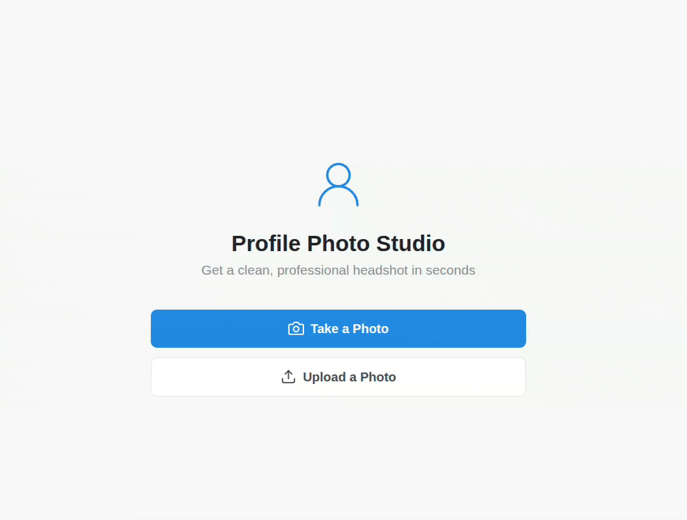

# Profile Photo Studio

<p align="center">
  
</p>

Web app that turns any photo or webcam capture into a clean, consistent circular profile picture. Detects the face, frames a headshot, corrects wide-angle distortion, normalizes lighting, removes the background, and outputs a transparent circular PNG.

<p align="center">
  
  
  
  
  
  
  
</p>

## Features

- **Webcam capture** or **drag-and-drop upload**
- **Face detection** via MediaPipe FaceLandmarker (468 landmarks)
- **Smart headshot framing** — auto-crops with face in upper frame, shoulders below
- **Perspective correction** — simulates a portrait lens (~50mm) to reduce webcam wide-angle distortion
- **Lighting normalization** — evens out left/right shadows without washing out skin tones (homomorphic illumination correction + gentle CLAHE + white balance)
- **Background removal** — BiRefNet portrait model with alpha matting for clean hair/edge detail
- **Circular output** — transparent PNG ready for profile use
- **Background color picker** — 6 color options on the result screen (transparent, white, blue, pink, navy, black)
- **CUDA accelerated** — runs on NVIDIA GPU when available, CPU fallback

## Requirements

- Python 3.11+
- NVIDIA GPU recommended (tested on RTX 4070 Super, ~500MB VRAM)

## Setup

```bash
python3 -m venv .venv
source .venv/bin/activate
pip install -r requirements.txt

# For GPU support, also install CUDA runtime libs:
pip install nvidia-cublas-cu12 nvidia-cudnn-cu12 nvidia-cufft-cu12 \
            nvidia-curand-cu12 nvidia-cuda-runtime-cu12 nvidia-cuda-nvrtc-cu12
```

## Run

```bash
./run.sh
```

Opens at [http://localhost:5000](http://localhost:5000). The first request downloads the BiRefNet model (~970MB) and warms up the pipeline.

`run.sh` handles activating the venv and setting `LD_LIBRARY_PATH` for CUDA. If you prefer to run manually:

```bash
source .venv/bin/activate
python app.py
```

## Project Structure

```
app.py                          Flask server (routes, model init)
run.sh                          Launch script with CUDA paths
requirements.txt                Python dependencies
processing/
  pipeline.py                   Orchestrator: detect → crop → correct → light → remove bg → circle
  face_detect.py                MediaPipe face detection + headshot crop computation
  bg_remove.py                  BiRefNet portrait background removal (GPU)
  lighting.py                   Illumination normalization + CLAHE + white balance
  face_landmarker.task          MediaPipe model file
static/
  css/style.css                 White theme, responsive layout
  js/app.js                     Webcam, upload, processing UI, color picker
templates/
  index.html                    Single-page app (4 screens)
```

## Pipeline Steps

1. **Decode + EXIF orient** — handles phone photo rotation
2. **Detect face** — MediaPipe FaceLandmarker, extracts landmarks and bounding box
3. **Crop headshot** — square crop sized at 3.2x face height, face centered at 45% from top
4. **Perspective correction** — pincushion distortion to counter wide-angle lens warping
5. **Normalize lighting** — illumination field normalization (face-aware), gentle CLAHE, light white balance
6. **Remove background** — BiRefNet portrait segmentation with alpha matting
7. **Resize** — 800x800 LANCZOS4
8. **Circle mask** — antialiased circular alpha mask

## Configuration

Key values in `processing/pipeline.py`:

| Setting | Default | Description |
|---------|---------|-------------|
| `OUTPUT_SIZE` | 800 | Final image dimensions (px) |
| `LENS_CORRECTION` | 0.5 | Perspective correction strength (0.0–1.0) |

Crop framing in `processing/face_detect.py`:

| Setting | Default | Description |
|---------|---------|-------------|
| Face height multiplier | 3.2 | Crop size relative to face (higher = more zoomed out) |
| Face vertical position | 0.45 | Face center position from top (higher = more headroom) |
